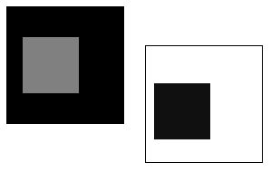

# phase_correl

This simple implementation represents phase correlation based image translation computing in action. Though it has not been optimized for speed, this algorithm is good base for real time image alignment. I used it as a base for my image processing researches in 2010 while working at Warsaw Univeristy of Technology.

Phase correlation feature matching was described by Yan H. and Liu J.G. in article "Roboust phase correlation based feature matching for image co-registration and DEM generation" (http://www.isprs.org/proceedings/XXXVII/congress/7_pdf/6_WG-VII-6/43.pdf).

## How it works

At first two monochromatic images are created, both containing squares of the same size but in different places. 


Next, 2D Fourier transform is applied on each of them, normalised cross power spectrum is computed, and inverted 2D Fourier transform is applied. Finally algorightm searches for a peak in obtained matrix, where address of peak found should match shift between images.

## How to compile

Simply clone this repository on linux machine by typing:
```
git clone https://github.com/markondej/phase_correlation.git
```
Then build executable binary with "make" command:
```
make
```
 
